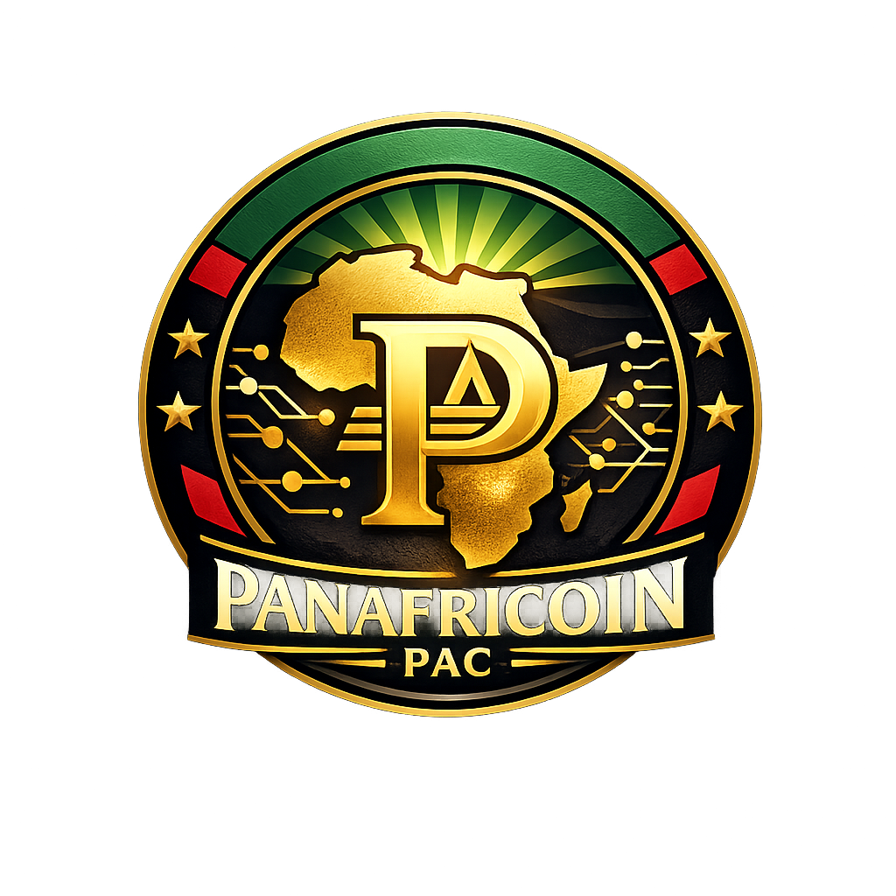
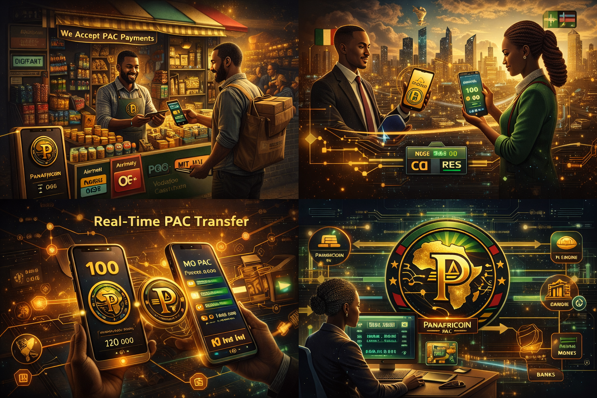
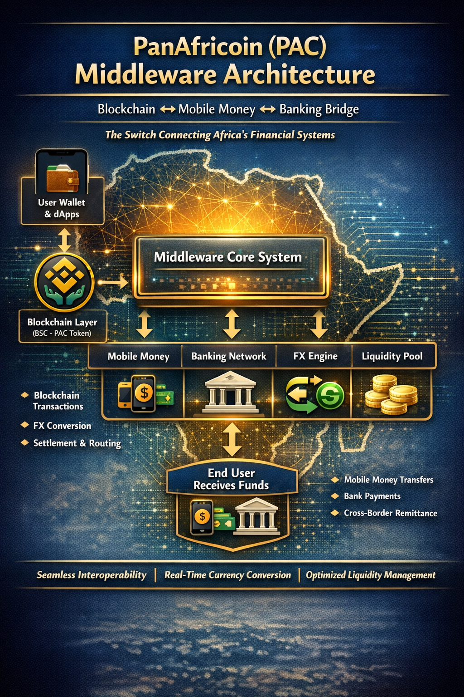

#  PanAfricoin
Africa's decentralized cryptocurrency

# 🌍 PanAfricoin (PAC)

### A Unified Digital Settlement Layer for African Trade

> Open-source blockchain + fintech infrastructure designed to connect African economies through a seamless, low-cost, and interoperable payment system powered by blockchain and mobile money integration.

<h2>👥 Originators</h2>

Below are the originators of this project:

<ul>
  <li>
    <strong>Solomon Yaw Adeklo</strong> 
    <a href="https://github.com/solomonyaw" target="_blank">
      https://github.com/solomonyaw
    </a>
  </li>
   
  <li>
    <strong>Emmanuel Ekpe</strong> 
    <a href="https://github.com/Elexy101" target="_blank">
      https://github.com/Elexy101
    </a>
  </li>
</ul>

---

## 🚀 Live Prototype

👉 **Try the working prototype here:**  
https://panafrica-coin--adeklosolomon.replit.app/

---

## 📌 Vision

PanAfricoin (PAC) is a financial infrastructure project designed to solve one of Africa’s most persistent economic challenges—**fragmented financial systems across countries**.

Despite rapid digital adoption, African economies still struggle with:

- Multiple incompatible currencies  
- High cross-border transaction fees  
- Slow settlement systems  
- Limited interoperability between mobile money platforms  
- Dependence on external currencies for trade settlement  

### 🌍 The Vision

PanAfricoin envisions a future where:

> “Money moves across Africa as freely as information moves on the internet.”

This means:
- A farmer in Ghana can trade instantly with a buyer in Kenya  
- A freelancer in Nigeria can receive payments from South Africa in seconds  
- Businesses can settle cross-border trade without currency friction  

---

## ⚙️ What PanAfricoin Is

PanAfricoin is:

- 🪙 A blockchain-based stable digital currency (PAC)
- 🔗 Built on BNB Smart Chain (BEP-20 standard)
- 🔁 Integrated with a middleware financial engine
- 📱 Connected to mobile money systems
- 🏦 Designed for banking interoperability

It is not just a token—it is a **financial settlement layer for Africa**.

---

## 🧠 Core Innovation: Middleware Layer

The key breakthrough of PanAfricoin is its **middleware system**, which connects blockchain to real-world financial infrastructure.

It enables:

- PAC ↔ Mobile Money conversion (MTN MoMo, Airtel Money, Vodafone Cash)
- PAC ↔ Bank transfers
- Real-time FX conversion between African currencies
- Cross-border transaction routing
- Compliance and settlement automation

---

## 🏗️ System Architecture

Users
↓
Wallet / Web App
↓
Blockchain Layer (PanAfricoin - PAC Token)
↓
Middleware Engine
↓
| Mobile Money | Banks | FX System |

↓
Local Currency Settlement

---

## 🔐 Token Model

PanAfricoin is designed as a **stable settlement currency**.

### Reserve Structure:
- 50% USD & stable assets  
- 30% African currency basket  
- 20% commodities (gold, etc.)  

### Goal:
Maintain **price stability for trade and payments**, not speculation.

---

## 🌍 Use Cases

- Cross-border payments  
- Intra-African trade settlement  
- Mobile money interoperability  
- Remittances across countries  
- SME digital commerce  
- Freelance global payments  

---

## 🧪 Current Status

This project is currently in **prototype phase**.

Working components include:
- Smart contract prototype (BEP-20 PAC token)
- Middleware simulation API
- FX conversion engine
- Mobile money integration mock system
- Functional web prototype interface

---

## 🤝 Open Source & Collaboration

PanAfricoin is an **open-source initiative**.

We believe that building Africa’s financial future cannot be done in isolation.

### 🌱 We are actively looking for collaborators in:

- Blockchain developers (Solidity, Web3)
- Backend engineers (Node.js, Python)
- Mobile app developers (React Native / Flutter)
- UI/UX designers
- Fintech engineers
- Economic policy researchers
- Government/Regulatory advisors

---

## 📢 Contribution Philosophy

We follow open innovation principles:

- Transparency over secrecy  
- Collaboration over competition  
- Utility over speculation  
- Infrastructure over hype  

Anyone is welcome to contribute ideas, code, or feedback.

---

## 📂 Repository Structure (Prototype)

contracts/
└── PanAfricoin.sol

backend/
├── server.js
├── services/
│ ├── blockchain.js
│ ├── fxEngine.js
│ └── mobileMoney.js

---

## 🧭 Origin of the Idea

The concept of PanAfricoin was originated by **Solomon Yaw Adeklo**, with the vision of creating a unified digital financial infrastructure that strengthens intra-African trade and economic integration.

The project is evolving as an open ecosystem built for collaboration.

---

## ⚠️ Disclaimer

PanAfricoin is currently a **prototype and experimental system**.  
It is not yet a regulated financial instrument and is under active development.

---

## 🌟 Roadmap

### Phase 1
- Prototype completion
- Testnet deployment
- Developer onboarding

### Phase 2
- Mobile money API integration
- Pilot in selected African countries

### Phase 3
- Institutional partnerships
- Regulatory sandbox participation

### Phase 4
- Pan-African scale deployment

---

## 📬 Get Involved

We are building something ambitious and foundational.

If you are interested in contributing:

- Fork the repository
- Submit pull requests
- Share ideas
- Join development discussions

---

## 🌍 Final Vision

PanAfricoin is not just a crypto project.

It is a proposal for:

> A unified financial layer for a digitally connected African economy.

